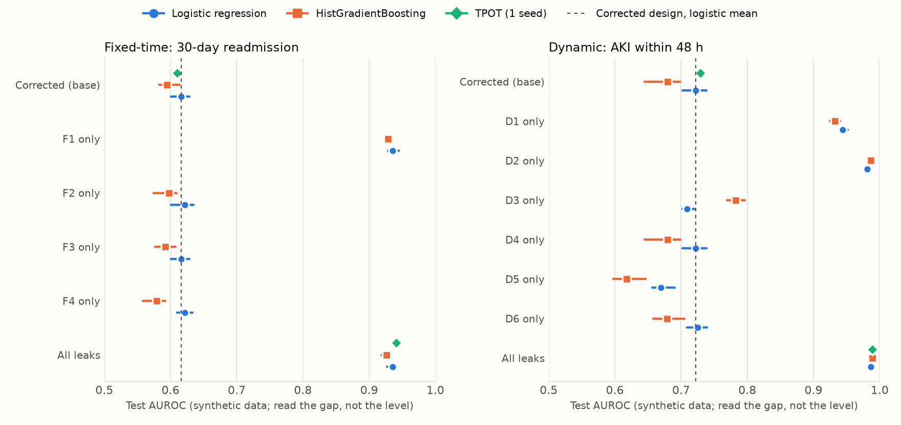

# 7단계 결과 보고서: 누수 점검 스킬 (가) vs (나)

- 작성일 2026-10-03. 모델 `claude-opus-5-5`, 변형 20개 × 조건 2 × 반복 3 = 120행 (보고서 119 + 빈칸 1).
- 판정은 잠긴 채점기(`experiment/grader.py`)와 고정된 기준(`docs/success_criteria.md`)으로만 했다. 분석 계획은 정답표를 열기 전에 `docs/step7_analysis_plan.md`로 커밋했다.
- 순서: 정답표 복호화(메모리) → 변형 20개 해시 대조 **통과** → 채점·요약 커밋(`4e76e7b`) → 그 뒤에 놓친 사례 본문을 읽음. 본문을 읽은 뒤 채점 결과는 바꾸지 않았다.
- **사후 분석**으로 표시한 부분은 결과를 본 뒤 추가한 것이다. 판정에 쓰지 않는다.

용어: **(가)** 누수 점검 스킬이 있는 조건, **(나)** 없는 조건. **배치** = 변형 하나에 심은 결함 하나(조건마다 배치-실행 72개). **주 분석** = 결함 항목을 지목하면 탐지, **보조 분석** = 항목과 문제 종류(Q)를 모두 맞혀야 탐지.

## 1. 한눈에 보기: H1·H2 (세 분석 나란히)

| | 주 분석 (채택된 실행, 판정용) | 첫 시도 분석 (같은 무게) | 빈칸 = 미탐지 분석 |
|---|---|---|---|
| 보고서 수 (가 / 나) | 59 / 60 | 60 / 60 | 60 / 60 |
| 탐지율 (가 / 나), 주 | 0.873 / 0.750 | 0.847 / 0.722 | 0.861 / 0.750 |
| **H1** ① 차이 (가−나), 95% CI | +0.123 [0.052, 0.203] → 충족 | +0.125 [0.032, 0.213] → 충족 | +0.111 [0.040, 0.190] → 충족 |
| **H1** ② 깨끗한 변형 (가) 오경보/보고서 ≤ 1 | 1.33 → **미달** | 1.67 → **미달** | 1.33 → **미달** |
| **H1 판정** | **지지 안 됨** | **지지 안 됨** | **지지 안 됨** |
| **H2** (가) 보류 6개 전체: 관측 vs 무작위 기대 | 0.783 vs 0.102 → 충족 | 0.708 vs 0.125 → 충족 | 0.750 vs 0.098 → 충족 |
| **H2** (가) 조정 안 한 보류 3개 | 1.000 vs 0.081 → 충족 | 1.000 vs 0.081 → 충족 | 1.000 vs 0.081 → 충족 |
| (나) 보류 6개 전체 (참고) | 0.708 vs 0.183 | 0.708 vs 0.177 | 0.708 vs 0.183 |
| (나) 조정 안 한 보류 3개 (참고) | 0.889 vs 0.137 | 0.889 vs 0.121 | 0.889 vs 0.137 |
| 점검기만으로 본 보류 탐지율 (2차 지표) | 0.652 (점검기 출력 59개) | 같음 | 같음 |
| **H2 판정** | **지지** | **지지** | **지지** |
| 보조 분석 H1 (항목 + 종류)¹ | +0.123 [0.000, 0.237], 오경보 1.33 → 미달 | +0.139 [0.030, 0.263], 1.67 → 미달 | +0.111 [0.000, 0.227], 1.33 → 미달 |
| 보조 분석 H2 (가) 보류 6개¹ | 0.783 vs 0.017 → 충족 | 0.708 vs 0.021 → 충족 | 0.750 vs 0.016 → 충족 |
| 종류 불명 지적 수 (가 / 나)¹ | 9 / 45 | 14 / 45 | 9 / 45 |

¹ **보조 분석의 한계**: 핵심어 사전이 점검기 표현을 더 잘 인식해 (가)에 유리할 수 있다 (5단계 확인: 점검기 문장 16/16, 자연스러운 표현 14/19 인정). 종류 불명은 (나)가 (가)의 5배다. 그래서 보조 분석은 판정에 쓰지 않는다.

**요약**
- **H1은 세 분석 모두 지지되지 않았다.** 탐지율 차이 조건(①)은 세 분석 모두 충족했지만, 깨끗한 변형에서 (가)의 오경보가 보고서당 1건을 넘었다(②). 기준은 바꾸지 않는다.
- **H2는 세 분석 모두 지지되었다.** 그러나 (나)도 같은 기준을 크게 넘는다(0.708 vs 0.183). 무작위 기대치는 낮은 기준이므로, H2는 "스킬이 보류 사례에서도 무작위보다 낫다"는 뜻일 뿐 "스킬 덕분에 보류 사례를 잡았다"는 근거가 아니다. 보류 탐지율의 (가)−(나) 차이는 +0.075(주 분석), 첫 시도 분석에서는 0이다.
- 주·보조 분석의 결론은 세 분석 모두 같다 (`primary_secondary_disagree` 빈 목록).
- 첫 시도 분석과 주 분석의 결론(H1 미달, H2 충족)은 같다. 다만 첫 시도 분석에서는 (가)의 보류 탐지율이 (나)와 같아진다(0.708).

## 2. 탐지율 세부 (주 분석)

| | (가) 주 | (가) 보조¹ | (나) 주 | (나) 보조¹ | 점검기만 |
|---|---|---|---|---|---|
| 전체 (배치-실행 71 / 72 / 71) | 0.873 | 0.831 | 0.750 | 0.708 | 0.887 |
| 공개 | 0.917 | 0.854 | 0.771 | 0.708 | — |
| 보류 6개 | 0.783 | 0.783 | 0.708 | 0.708 | 0.652 |
| 보류 중 조정 안 한 3개 | 1.000 | 1.000 | 0.889 | 0.889 | — |

질문(Q)별 (주 분석, 공개 + 보류)

| Q | 내용 | n | (가) | (나) | 점검기만 |
|---|---|---|---|---|---|
| Q1 | 가용 시점 | 15 | 0.93 | 0.93 | 1.00 |
| Q2 | 분할 단위 | 12 | 1.00 | 0.92 | 1.00 |
| Q3 | 적합 범위 | 12 | 0.92 | 0.67 | 1.00 |
| Q4 | 결과 출처 | 12 | 1.00 | 0.92 | 1.00 |
| Q5 | 선택 시점 | 12 | 0.92 | 0.83 | 0.75 |
| Q7 | 결과 확인 균질성 | 8 / 9 | 0.25 | 0.00 | 0.38 |

- 차이가 큰 곳은 **Q3(전처리를 전체 데이터로 적합)**과 **Q7**이다. Q7은 두 조건 모두 낮다.
- 반복 간 안정성(같은 배치의 반복 3회가 모두 같은 판정인 비율): (가) 0.83, (나) 0.71.

오경보 (주 분석, 보고서당 평균)

| | (가) | (나) |
|---|---|---|
| 깨끗한 변형 (보고서 12 / 12) | 1.33 (16건) | 2.83 (34건) |
| 결함 변형 (47 / 48) | 0.57 (27건) | 1.69 (81건) |
| 점검기만 | 0 | — |

기타 개수 (가 / 나): 점검 불가 지적 8 / 12, 대상 불명 2 / 13, 형식 오류("목록 없음") 3 / 6, 결함 항목에 붙은 추가 판정 29 / 22.

## 3. 핵심 시연 예시: Q7 결과 확인 강도 (`design_A1C2`, 공개 E17)

ICU는 크레아티닌을 매일, 병동은 드물게 재서 AKI 확인 강도가 다른데, 설계서가 이를 층별로 다루지 않는 결함이다. (가) 2/3 탐지, (나) 0/3.

- 점검기 출력 (가): `Q7 경고 — 결과 측정 빈도(회/일)가 'unit' 층마다 다르다: ICU 1.91, ward 0.68 (비 2.8 ≥ 2). 자주 측정하는 층에서 결과가 더 많이 확인된다.`
- (가) 보고서 `219037c808cb`: "크레아티닌 측정 횟수가 ICU 하루 1.91회, 일반 병동 0.68회로 2.8배 다른데, 설계서가 병동 종류별 결과 확인 강도 차이를 다루지 않습니다. 그래서 자주 재는 층에서 AKI가 더 많이 확인되는 편향이 생깁니다."
- (나) 보고서 3개는 모두 같은 결과 영역에서 **결과 창이 퇴원·사망으로 잘리는 문제**(`outcome.window`)는 지적했지만, 층별 측정 빈도 차이는 지적하지 않았다.
- (가)에서 놓친 1개(`cd939d7b849c`)는 내용이 아니라 형식 때문이다: `findings` 목록을 작업 폴더의 보고서 파일에 쓰고 마지막 메시지에는 붙이지 않았다 (4절).

## 4. 놓친 사례 분석

### 4.1 (가)가 놓친 배치 9개 (주 분석)

| 원인 | 배치-실행 | 내용 |
|---|---|---|
| E18 (보류, 조정함, Q7) | 5 / 5 | 아래 4.3 |
| 형식 오류 "목록 없음" | 4 | `96186aafef80` (E08·E15), `cd939d7b849c` (E01·E17). 마지막 메시지 본문에는 네 항목 이름이 모두 나온다 |

형식 오류를 빼면 (가)가 **내용으로** 놓친 것은 E18뿐이다.

### 4.2 (나)가 놓친 배치 18개

- E18 6 / 6, E17 3 / 3 (Q7 전부)
- 형식 오류 "목록 없음" 9개 (보고서 6개). 마지막 메시지 본문에는 9개 모두 항목 이름이 나온다.
- 그 밖에는 없다.

**사후 분석 (형식 오류)**: 마지막 메시지 본문에 결함 항목 이름이 나오면 탐지로 친다고 가정하면, 주 분석 탐지율은 (가) 0.873 → 0.930, (나) 0.750 → 0.875가 된다. 문자열 검색일 뿐이고 채점 규칙이 아니다. 형식 오류는 (나)에 더 많아(6 vs 3) **조건 차이의 일부가 내용이 아니라 보고 형식에서 왔을 수 있다**.

### 4.3 보류 사례별, 그리고 4단계 조정의 영향

| 보류 | Q | 조정 | (가) | (나) | 점검기만 |
|---|---|---|---|---|---|
| E04 날짜만 있는 시술 (23:59 규칙) | Q1 | 없음 | 3/3 | 3/3 | 3/3 |
| E05 랜드마크 행 단위 분할 | Q2 | 없음 | 3/3 | 3/3 | 3/3 |
| E09 진단 코드별 결과율 인코딩을 전체 데이터로 | Q3 | 없음 | 3/3 | 2/3 (형식 오류 1) | 3/3 |
| E11 결과 창 안 크레아티닌 (변화량 → 최댓값) | Q4 | 있음 | 6/6 | 6/6 | 6/6 |
| E16 퇴원 후 외래 방문이 있는 환자만 포함 | Q5 | 있음 | 3/3 | 3/3 | 0/3 (점검 불가) |
| E18 재입원을 본원 기록으로만 확인 (퇴원처별 확인 강도) | Q7 | 있음 | 0/5 | 0/6 | 0/5 |

- **E11**: 변화량을 "결과 창 안 최댓값"으로 바꾼 조정은 결과 창의 값을 그대로 특징으로 쓰는 형태라 더 눈에 띄게 만들었을 수 있다. 두 조건 모두 전부 탐지.
- **E16**: 조정으로 새 외래 방문 테이블을 넣었고, 동결된 규칙표에 이 테이블 규칙이 없어 **점검기는 3/3 점검 불가**였다. 그런데 (가) 에이전트는 3/3 모두 지적했다. 점검기가 멈춘 곳을 에이전트의 판단이 메운 사례다.
- **E18**: 조정으로 "기본 설계에 확인 방식 층별 보고를 넣고, 주입은 그 항목을 삭제"하는 설계서 수준 결함이 되었다. 조정 기록대로 합성 데이터는 퇴원처별 확인 강도 차이를 만들지 않았을 수 있다. 결과는 **두 조건과 점검기 모두 0**이다. 보고서 본문을 보면 (가) 3개, (나) 1개가 "전원·타 병원 재입원은 데이터에 잡히지 않는다"를 **본문 참고 사항**으로 적었지만 `findings` 목록에는 넣지 않았다 (목록 밖 서술은 채점하지 않는다). 이 조정이 탐지를 어렵게 만든 것으로 보인다.
- 조정하지 않은 보류 3개만 보면 (가) 9/9, (나) 8/9(놓친 1개는 형식 오류)로, 내용 기준으로는 두 조건 모두 다 잡았다.

### 4.4 오경보의 내용 (사후 분석)

규칙상 결함을 심지 않은 항목의 지적은 모두 오경보다. 내용을 보면 대부분 **기본 설계서와 합성 데이터에 실제로 있는 약점**이다.

| 지적 항목 | (가) 깨끗한 / 결함 | (나) 깨끗한 / 결함 | 내용 |
|---|---|---|---|
| `features.dx_*`, `n_dx` (고정 시점) | 9 / 9 | 15 / 36 | 퇴원 진단 코드는 퇴원 뒤 코딩되어 퇴원 시각에 없을 수 있다 (규칙표의 코딩 지연 0시간 가정) |
| `outcome.window` | 4 / 4 | 4 / 11 | 결과 창이 퇴원·사망으로 잘리거나 데이터 끝 30일 안 퇴원의 추적이 짧다 (검열 처리 없음) |
| `split` | 0 / 9 | 12 / 28 | `family_id`가 환자의 80%에서 결측 |
| 그 밖 (`los_h`, `age`, `unit` 등) | 3 / 5 | 3 / 6 | 열 없음, 나이 기준 시점 등 |

- (가)는 진단 코드 지적에 "점검 통과는 코딩 지연 0시간 가정(`DX_CODING_DELAY_H=0`)에 기댄다"고 근거를 달았다. 규칙표의 가정을 사람에게 확인하라고 넘긴 것이라, 스킬이 의도한 행동에 가깝다.
- 이 지적들을 정당한 것으로 보면 H1 ②가 달라질 수 있다. 그러나 **기준은 실험 전에 고정했으므로 판정은 바꾸지 않는다.** 다음 연구에서는 기본 설계서의 이런 약점을 먼저 없애거나 "정당한 지적" 목록을 미리 정해야 한다.
- `split` 지적이 (가)의 깨끗한 변형에서 0인 것은 채점기 문제와 관련 있다 (4.5).

### 4.5 채점기에서 발견한 문제 (`docs/known_issues.md`)

- "점검 불가" 핵심어(`규칙이 없어`, `규칙이 없다`)가 "결측 **처리 규칙이 없다**" 같은 일반 문장에도 맞아, 지적 (가) 8, (나) 12건이 점검 불가로 분류되었다. 모두 결함을 심지 않은 항목이라 **탐지율에는 영향이 없고 오경보가 적게 세어졌다**.
- 사후 계산으로 바로잡으면 깨끗한 변형 오경보는 (가) 1.33 → 1.58, (나) 2.83 → 3.17이다. H1 ②의 미달은 바로잡아도 그대로다. 판정은 잠긴 결과 그대로 둔다.

## 5. 실행 과정의 참고 분석 (6단계 결정)

- **점검기 호출**: (가) 채택 실행 59/59가 점검기를 불렀다(첫 시도 기준 60/60). 그래서 "부른 실행 / 부르지 않은 실행" 나누기는 의미가 없다(부르지 않은 실행 0, 그중 권한 거부 0). 채택 실행의 점검기 호출 거부 0.
  - `run status`의 (가) 점검기 호출 60, 호출 거부 1은 빈칸 행의 폐기된 마지막 시도가 섞인 값이다 (`docs/known_issues.md`).
- **오염 폐기**: (가) 50건(파일 시스템 전체 탐색 39, 자기 폴더 안 `..` 11), (나) 2건(둘 다 `..`). (가) 60행 중 24행(40%)은 첫 시도가 폐기되었다.
  - 설계서별 분포 (가): 20개 중 14개에 폐기가 있고, 가장 많은 것은 `design_800E` 7건(빈칸 행 6건 포함), `design_E6D6`·`design_F872` 6건, `design_AF15`·`design_EC59`·`design_7F4F` 5건. 특정 설계서 하나에 몰리지는 않았다. (나)는 `design_0B14` 2건.
  - 걸린 호출 중 권한 거부 없이 실제 실행된 것: (가) 13건, (나) 1건. 사람이 확인한 결과 자기 실행 폴더 밖에 닿은 것은 2건, 둘 다 (가)·폐기됨(경로 이름만 봄, 파일 내용은 보지 않음, 정답표는 암호화 상태). 근거는 `results/discards.json`, `docs/phases.md` 6단계.
- 시도당 평균 시간: (가) 94초, (나) 191초.

## 6. 누수 효과 시연 (보조 분석, `experiment/leakage_effect.py`)

누수 목록은 실행 전에 `docs/step7_analysis_plan.md` 4.1에 고정했다 (공개 오류 목록에서만). 수정 설계 = 기본 설계서(점검기 통과).
모든 설계(누수 설계 포함)는 결정 카드 → 승인 → 잠금 뒤에만 `leakcheck.lock.auroc`로 AUROC를 계산했다. 특징은 출처 기록 함수(`make_feature`)로만 만들었고, 만들지 못해 뺀 특징은 없다.
시험 집합 AUROC, 로지스틱 회귀·부스팅은 분할 시드 5개의 평균 [최소–최대], TPOT는 시드 1개. **차이**는 수정 설계 평균 대비.

**고정 시점 (30일 재입원)** — 수정 설계: 로지스틱 0.616 [0.601–0.628], 부스팅 0.595 [0.583–0.613], TPOT 0.610

| 누수 | 로지스틱 | 차이 | 부스팅 | 차이 | 학습·시험에 걸친 가족 |
|---|---|---|---|---|---|
| F1 다음 입원 병동 특징 (Q4) | 0.936 [0.929–0.944] | **+0.320** | 0.928 [0.925–0.932] | **+0.334** | 0 |
| F2 입원 단위 분할 (Q2) | 0.622 [0.600–0.635] | +0.006 | 0.598 [0.574–0.609] | +0.003 | 241 |
| F3 대치를 전체 데이터로 (Q3) | 0.616 [0.601–0.628] | −0.000 | 0.592 [0.577–0.607] | −0.002 | 0 |
| F4 특징 선택을 전체 데이터로 (Q3) | 0.622 [0.610–0.633] | +0.006 | 0.579 [0.558–0.592] | −0.015 | 0 |
| 모두 | 0.935 [0.927–0.942] | **+0.319** | 0.926 [0.918–0.931] | **+0.331** | 241 |
| 모두 — TPOT | 0.941 | **+0.331** | | | |

**동적 AKI (48시간)** — 수정 설계: 로지스틱 0.722 [0.702–0.738], 부스팅 0.679 [0.645–0.699], TPOT 0.729

| 누수 | 로지스틱 | 차이 | 부스팅 | 차이 | 학습·시험에 걸친 가족 |
|---|---|---|---|---|---|
| D1 이번 입원 AKI 진단 코드 (Q1) | 0.944 [0.939–0.952] | **+0.222** | 0.933 [0.924–0.940] | **+0.253** | 0 |
| D2 입원 전체 최고 크레아티닌 (Q1) | 0.981 [0.979–0.983] | **+0.259** | 0.986 [0.985–0.988] | **+0.307** | 0 |
| D3 행(예측 시점) 단위 분할 (Q2) | 0.709 [0.702–0.720] | −0.013 | 0.782 [0.769–0.797] | **+0.103** | 389 |
| D4 대치를 전체 데이터로 (Q3) | 0.722 [0.702–0.738] | +0.000 | 0.679 [0.645–0.699] | +0.000 | 0 |
| D5 특징 선택을 전체 데이터로 (Q3) | 0.670 [0.657–0.690] | −0.053 | 0.618 [0.598–0.646] | −0.061 | 0 |
| D6 투석·신장내과 오더 (Q4 경고) | 0.725 [0.709–0.739] | +0.003 | 0.679 [0.658–0.705] | −0.001 | 0 |
| 모두 | 0.986 [0.985–0.988] | **+0.264** | 0.989 [0.988–0.990] | **+0.310** | 389 |
| 모두 — TPOT | 0.988 | **+0.259** | | | |

해석 (누수 유무에 따른 차이만 본다)
- **결과 정보가 특징으로 들어간 누수(Q1·Q4 특징: F1, D1, D2)는 AUROC를 0.22~0.33 올린다.** 시드 간 범위(약 0.02~0.05)보다 훨씬 크다. 세 모델 모두 같은 방향이다.
- **행 단위 분할(D3)은 부스팅만 +0.10 올리고 로지스틱은 그대로다.** 같은 입원의 여러 예측 시점이 학습·시험에 나뉘면, 환자를 "외울" 수 있는 유연한 모델만 이득을 본다. 입원 단위 분할(F2)은 재입원이 있는 가족이 적어(241) 효과가 작다.
- **전처리를 전체 데이터로 적합하는 누수(Q3: F3, D4, D5)는 이 데이터에서 효과가 거의 없거나 오히려 낮아졌다.** 표본이 크고(학습 4,776~16,217행) 특징이 적어(12~18열) 시험 행이 중앙값·선택 결과를 거의 바꾸지 못한다. D5·F4의 하락은 누수 때문이 아니라 특징을 절반으로 줄여 정보가 빠졌기 때문이다. Q3 누수는 특징이 많고 표본이 작을 때 커진다(Kapoor & Narayanan의 사례). 이 시연은 그 조건이 아니다.
- **대리 변수(D6)는 효과가 없다.** 합성 데이터의 투석·협진 오더가 tₚ 이전에는 AKI와 약하게만 연결된 것으로 보인다. 점검기 판정도 "차단"이 아니라 "경고"다.
- 즉, 점검기가 차단하는 누수 중 **AUROC를 크게 부풀리는 것은 특징 누수였고**, 분할·전처리 누수의 크기는 모델과 데이터 형태에 달려 있었다.

**TPOT 교차검증 분할 단위 확인**
- TPOT 1.1.0의 `fit(X, y)`는 그룹을 받지 않는다. `cv`에 정수를 주면 `StratifiedKFold(shuffle=True)`, 즉 **행 단위** 분할을 쓴다 (소스 `tpot_estimator/estimator.py`). 기본값이었다면 학습 집합의 가족(없으면 환자) 중 행이 둘 이상인 묶음이 여러 폴드에 나뉜다: 고정 시점 1,087개 중 933개, 동적 2,812개 중 2,667개. **TPOT 자체가 Q2 누수를 일으킨다.**
- 우회: 학습 집합을 가족 단위로 5개 폴드로 미리 나눈 객체(`GroupFolds`, `split()` 제공)를 `cv`로 넘겼다. sklearn `check_cv`는 이 객체를 그대로 쓰고, TPOT는 평가마다 `cv.split(X, y)`를 부른다 (`cross_val_utils.py`).
- 실행으로 확인: 네 번의 TPOT 실행 모두 TPOT 안의 `cv_gen`이 이 객체였고, `split` 호출 54~55회, 폴드 사이에 걸친 가족 0개.
- 이 컨테이너에서는 TPOT의 dask 작업자 프로세스가 시작되지 않아 `processes=False`(스레드)로 돌렸다. 설정은 세대 5, 개체 12, 시간 제한 5분이었고, 실제로는 세대 제한에 먼저 걸려 88~169초에 끝났다.
- TPOT 결과도 로지스틱·부스팅과 같은 방향이다 (수정 0.610 / 0.729 → 모두 넣은 설계 0.941 / 0.988).

## 7. 한계

1. **합성 데이터**: AUROC와 결과율에는 임상적 의미가 없다. 기본 설계서와 데이터 자체에 약점(진단 코드 코딩 지연, `family_id` 80% 결측, 결과 창 검열)이 있어 오경보 판정에 섞였다 (4.4).
2. **부분 맹검**: 결함을 심은 사람과 분석한 사람이 같다. 채점은 조건을 가린 채 규칙 코드로 했지만, 보류 사례 일부는 봉인 해제 뒤 조정했다(E11, E16, E18).
3. **같은 모델 계열**: 에이전트, 스킬 작성, 분석 보조가 모두 Claude다.
4. **두 조건 모두 기본 스킬 18개가 로드되었다** (6단계 기록). (나)는 "스킬이 전혀 없는" 조건이 아니라 "누수 점검 스킬만 없는" 조건이다.
5. **격리가 권한 규칙과 사후 검사에 의존**했다 (root 실행). 검사가 알아보지 못하는 경로 조합은 막지 못한다. 오염 폐기는 (가) 50, (나) 2건으로 크게 비대칭이다.
6. **폐기의 주된 원인**: 지침서(`SKILL.md`)가 규칙표 파일(`leakcheck/rules.py`)을 언급하지만 위치를 알려 주지 않아, (가) 에이전트가 `find /` 같은 전체 탐색을 시도했다. 지침서는 동결되어 고치지 않았다. 이 때문에 (가)의 채택 실행은 "다시 돌려서 탐색하지 않은 실행"이라는 선택이 걸려 있다. 그래서 첫 시도 분석을 같은 무게로 냈다(결론 같음).
7. **권한 규칙이 점검기 사용을 일부 방해했다** (시험 실행 4·5차). 본 실행에서는 훅으로 풀어 점검기 호출 거부 0이었다.
8. **보고서 = 마지막 메시지**: `findings`를 파일에만 쓴 보고서는 형식 오류로 미탐지가 되었다 ((가) 3, (나) 6개). 조건 차이 일부가 형식에서 왔을 수 있다 (4.2).
9. **채점기의 점검 불가 핵심어 문제** (4.5): 오경보를 적게 셌다. 판정 방향은 같다.
10. **H2의 무작위 기준은 약하다**: (나)도 넉넉히 넘는다. 스킬 효과의 근거로는 (가)−(나) 차이를 봐야 한다.
11. **표본이 작다**: 결함 변형 16개, 반복 3회. 신뢰구간이 넓다.

## 8. 면접용 한 문단 요약

표 형식 임상 데이터를 분석하는 AI 에이전트에게 "분석 전에 설계의 누수를 스스로 점검하는 스킬"을 주면 결함을 더 잘 잡는지, 합성 EHR에 결함 24개를 맹검으로 심은 설계서 20개로 120회 실험했습니다. 스킬이 있을 때 탐지율은 87%, 없을 때 75%였고, 그 차이(+12%p, 95% 신뢰구간 5~20%p)는 미리 정한 기준을 넘었습니다. 하지만 결함이 없는 설계서에서 보고서당 오경보가 1.3건으로, 미리 정한 기준(1건 이하)을 넘어 주 가설은 지지되지 않았습니다. 오경보의 대부분은 진단 코드의 코딩 지연이나 추적 기간 검열처럼 기본 설계 자체에 있던 약점이어서, 다음에는 "정당한 지적"의 정의를 먼저 정해야 한다는 교훈을 얻었습니다. 보류해 둔 사례에서도 스킬은 무작위보다 훨씬 잘 잡았지만(78% 대 10%), 스킬이 없는 조건도 71%를 잡아 차이는 작았습니다. 두 조건과 규칙 기반 점검기가 모두 놓친 것은 퇴원처에 따라 재입원 확인 강도가 달라지는 문제였습니다. 같은 데이터로 누수가 성능을 얼마나 부풀리는지도 시연했는데, 결과 정보가 특징에 섞이면 AUROC가 0.6~0.7에서 0.93~0.99로 뛰었습니다. 자동 머신러닝 도구 TPOT는 기본 설정에서 한 환자의 여러 행을 교차검증 폴드에 나눠 넣어 그 자체로 누수를 만든다는 것도 확인했고, 환자 단위 폴드를 미리 만들어 넘기는 방식으로 우회했습니다. 판정은 결과를 보기 전에 잠근 규칙 코드로 했고, 채점 결과를 먼저 커밋한 뒤에야 보고서 본문을 읽었습니다.
